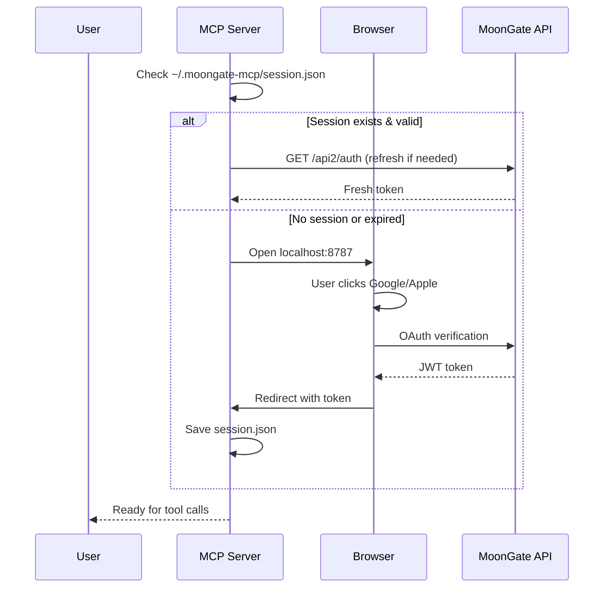

# MoonGate MCP Server

[](https://www.npmjs.com/package/moongate-mcp-server)
[](https://opensource.org/licenses/MIT)

Model Context Protocol (MCP) server for [MoonGate](https://moongate.one) - the Solana wallet with zero-friction authentication.

This server enables AI assistants and tools like Claude (via API or Desktop), OpenClaw, and Cursor to interact with your MoonGate wallet:
- 🔑 Sign transactions and messages
- 💸 Send tokens (SOL and SPL tokens)
- 📊 View portfolio and balances
- 🔄 Swap tokens
- 🔐 OAuth-based authentication (Google/Apple)

## Quick Start

### Installation

```bash
npm install -g moongate-mcp-server
```

### Configuration

#### For Claude Desktop

Add to your `~/Library/Application Support/Claude/claude_desktop_config.json` (macOS) or `%APPDATA%\Claude\claude_desktop_config.json` (Windows):

```json
{
  "mcpServers": {
    "moongate": {
      "command": "npx",
      "args": ["-y", "moongate-mcp-server"],
      "env": {
        "MOONGATE_API_URL": "https://wallet.moongate.one"
      }
    }
  }
}
```

#### For Cursor

Add to your Cursor MCP settings:

```json
{
  "mcpServers": {
    "moongate": {
      "command": "npx",
      "args": ["-y", "moongate-mcp-server"]
    }
  }
}
```

#### For OpenClaw or Custom Integrations

Use the MCP SDK to connect to the server programmatically. See the [MCP documentation](https://modelcontextprotocol.io) for details on client implementation.

### Authentication

**📖 See [AUTH-GUIDE.md](./AUTH-GUIDE.md) for detailed instructions with screenshots.**

**TL;DR:** Use a token from your browser session (recommended):

1. Log into [wallet.moongate.one](https://wallet.moongate.one)
2. Open DevTools → Application → Local Storage
3. Copy the `token` value
4. Add it to your MCP config as `MOONGATE_TOKEN`

**For Claude Desktop:**
```json
{
  "mcpServers": {
    "moongate": {
      "command": "npx",
      "args": ["-y", "moongate-mcp-server"],
      "env": {
        "MOONGATE_TOKEN": "eyJhbGciOiJSUzI1NiIsInR5cCI6..."
      }
    }
  }
}
```

**Tokens expire after 7 days** - just grab a fresh one from your browser when needed.


## Available Tools

### `get_wallet_address`

Get your MoonGate wallet's public key (address).

```
// No parameters required
```

**Returns:**
```json
{
  "publicKey": "5xGj3..."
}
```

---

### `sign_message`

Sign a message with your wallet.

**Parameters:**
- `message` (string | number[]): The message to sign

**Returns:**
```json
{
  "signature": "4vJ5a..."
}
```

---

### `sign_transaction`

Sign a Solana transaction (optionally broadcast it).

**Parameters:**
- `serializedTransaction` (number[]): Serialized transaction bytes
- `type` (string): Transaction type - "legacy" or "versioned" (default: "versioned")
- `broadcast` (boolean): Whether to broadcast after signing (default: false)
- `includePayerSignature` (boolean): Include payer signature (default: true)

**Returns:**
```json
{
  "signatures": ["..."],
  "signedTransaction": [/* bytes */],
  "txSignature": "3nZ4..." // if broadcast=true
}
```

---

### `send_token`

Send SOL or SPL tokens to another address. Fetches your portfolio to resolve the token, verify balance, and use correct decimals.

**Parameters:**
- `tokenMint` (string): Token mint address (optional if tokenName/tokenSymbol provided)
- `tokenName` (string): Token name to search in portfolio (e.g. "Wrapped SOL")
- `tokenSymbol` (string): Token symbol to search in portfolio (e.g. "SOL", "USDC")
- `toAddress` (string): Recipient wallet address
- `amount` (number): Amount to send
- `decimals` (number): Token decimals (optional; auto-fetched from portfolio)
- `userWallet` (string): Optional - sender address (auto-detected if omitted)

**Note:** Provide at least one of `tokenMint`, `tokenName`, or `tokenSymbol`. The token must exist in your portfolio.

**Returns:**
```json
{
  "success": true,
  "signature": "2wE3..."
}
```

---

### `get_portfolio`

Get wallet portfolio (tokens, balances, NFTs).

**Parameters:**
- `walletAddress` (string): Optional - wallet to query (defaults to your wallet)

**Returns:**
```json
{
  "tokens": [...],
  "totalValue": 1234.56,
  "nfts": [...]
}
```

---

### `search_token`

Search for Solana tokens by name, symbol, or mint address. Returns top results sorted by market cap.

**Parameters:**
- `query` (string): Token name (e.g. "Solana"), symbol (e.g. "SOL"), or mint address
- `limit` (number): Maximum results to return (default: 10, max: 100)

**Returns:**
```json
{
  "success": true,
  "results": [
    {
      "mint": "So11111111111111111111111111111111111111112",
      "name": "Wrapped SOL",
      "symbol": "SOL",
      "decimals": 9,
      "price": "$86.46",
      "marketCap": "52474839784",
      "volume24h": "139815210",
      "holders": 2877594,
      "image": "https://..."
    }
  ],
  "count": 1
}
```

---

### `swap_token`

Swap tokens via MoonGate DEX integration (Jupiter). Supports searching by name/symbol or mint address.

**Parameters:**
- `inputMint` (string): Input token mint address (optional if inputToken provided)
- `inputToken` (string): Input token name/symbol (e.g. "SOL", "USDC") - searches for mint
- `outputMint` (string): Output token mint address (optional if outputToken provided)
- `outputToken` (string): Output token name/symbol (e.g. "SOL", "USDC") - searches for mint
- `inputAmount` (number): Amount of input token to swap
- `slippagePercentage` (number): Slippage tolerance in basis points (default: 100 = 1%)
- `transactionSpeed` (string): Priority - "slow", "normal", or "fast" (default: "normal")

**Note:** Provide either mint address OR name/symbol for each token. Name/symbol search returns the top result by market cap.

**Returns:**
```json
{
  "success": true,
  "signature": "4xK2...",
  "transactionCount": 1,
  "inputToken": "USDC",
  "outputToken": "SOL",
  "inputAmount": 100
}
```

---

### `get_token_info`

Get detailed token information including security analysis and rugpull risk indicators.

**Parameters:**
- `tokenMint` (string): Token mint address (optional if tokenName provided)
- `tokenName` (string): Token name or symbol to search for

**Returns:**
```json
{
  "token": {
    "mint": "DezXAZ8z7PnrnRJjz3wXBoRgixCa6xjnB7YaB1pPB263",
    "name": "Bonk",
    "symbol": "BONK",
    "decimals": 5,
    "supply": 87995151415980.58,
    "createdAt": 1670531612
  },
  "price": {
    "usd": 0.00000646,
    "marketCap": 568745265,
    "circulatingMarketCap": 531283669
  },
  "security": {
    "mintable": false,
    "freezable": false,
    "lockedLiquidityPercent": 75,
    "topHoldersPercent": 33.56,
    "devHoldersPercent": 0.000000166,
    "snipersPercent": 0
  },
  "market": {
    "liquidity": 178311,
    "holders": 987817,
    "buyCount24h": 5165,
    "sellCount24h": 5630,
    "buyerSentimentPercent": 47.85
  },
  "socialLinks": {
    "website": "https://www.bonkcoin.com",
    "twitter": "https://twitter.com/bonk_inu",
    "telegram": "https://t.me/Official_Bonk_Inu"
  },
  "riskAssessment": {
    "overallRisk": "LOW",
    "riskIndicators": ["No major red flags detected"],
    "safetyIndicators": [
      "Good liquidity ($178.3K)",
      "987,817 holders",
      "Good distribution (top holders: 33.6%)",
      "✓ Not mintable or freezable",
      "75% liquidity locked",
      "Has social media presence"
    ],
    "recommendation": "✓ Appears relatively safe, but always DYOR (Do Your Own Research)"
  }
}
```

**Risk Indicators:**
- **Liquidity:** Low liquidity (<$10K) flags high rugpull risk
- **Holder Distribution:** Top holders >50% indicates concentration risk
- **Security:** Mintable/freezable tokens can be manipulated
- **Locked Liquidity:** <50% locked is risky
- **Age:** Very new tokens (<7 days) are higher risk
- **Social Presence:** No social links is suspicious
- **Sentiment:** Low buyer percentage (<30%) indicates bearish market

**Risk Levels:**
- `LOW`: 0-1 risk indicators
- `MODERATE`: 2-4 risk indicators  
- `HIGH`: 5+ risk indicators

## Environment Variables

| Variable | Description | Default |
|----------|-------------|---------|
| `MOONGATE_API_URL` | MoonGate API base URL | `https://wallet.moongate.one` |
| `MOONGATE_CALLBACK_PORT` | OAuth callback port | `8787` |
| `MOONGATE_MCP_DEBUG` | Debug logging (verbose) | `true` (set to `false` to disable) |
| `MOONGATE_TOKEN` | Manual token (for testing) | - |

## Development

### Local Setup

```bash
git clone https://github.com/invictusdhahri/moongate-mcp-server.git
cd moongate-mcp-server
npm install
npm run build
```

### Testing

For quick testing without OAuth flow, set a manual token:

```bash
export MOONGATE_TOKEN="your-jwt-token"
npm run dev
```

### Building

```bash
npm run build
```

The built files will be in `dist/`.

## Authentication Flow



## Security

- **Session Storage**: Tokens stored in `~/.moongate-mcp/session.json` with `0o600` permissions (user read/write only)
- **Auto-Refresh**: Tokens automatically refresh when within 1 hour of expiry
- **Password-less Signing**: All signing operations use empty password per MoonGate OAuth design
- **Local OAuth**: Authentication happens via localhost callback, not exposing credentials

## Roadmap

- [x] Phase 1: Core tools (get address, sign message/tx)
- [x] Phase 2: OAuth browser flow, send tokens
- [x] Phase 3: Portfolio & swap tools
- [x] Phase 4: Token search and rugpull analysis
- [x] Phase 5: npm publish as `moongate-mcp-server`
- [ ] Phase 6: NFT operations (list, transfer, mint)
- [ ] Phase 7: Token metadata updates
- [ ] Phase 8: Multi-wallet support

## Troubleshooting

### "Not authenticated" or "Invalid token" error

Your token has expired (7-day lifetime). Get a fresh one:

1. Go to [wallet.moongate.one](https://wallet.moongate.one) and log in
2. Open DevTools → Application → Local Storage → `https://wallet.moongate.one`
3. Copy the `token` value
4. Update `MOONGATE_TOKEN` in your MCP config
5. Restart Claude Desktop / your MCP client

### OAuth callback times out or "localhost:8787" won't load

**Solution:** Use the manual token method instead (see Authentication section above). The local OAuth server requires port 8787 to be available and may not work in sandboxed environments.

If you need OAuth: set `MOONGATE_CALLBACK_PORT` to another port and ensure it's accessible.

### Debug logging

Debug logging is **enabled by default**. To disable it:

```bash
export MOONGATE_MCP_DEBUG=false
```

### Testing with MCP Inspector

The MCP Inspector provides a web UI to test your server:

```bash
npx @modelcontextprotocol/inspector node dist/cli.js
```

This will open a browser where you can:
- View all available tools
- Test tool calls with a form UI
- See request/response logs in real-time
- Debug without needing Claude Desktop

## Contributing

Contributions welcome! Please open an issue or PR.

## License

MIT

## Links

- [MoonGate Website](https://moongate.one)
- [MoonGate Docs](https://docs.moongate.one)
- [Model Context Protocol](https://modelcontextprotocol.io)
- [GitHub Repository](https://github.com/invictusdhahri/moongate-mcp-server)

---

**Built with ❤️ for the Solana ecosystem**
