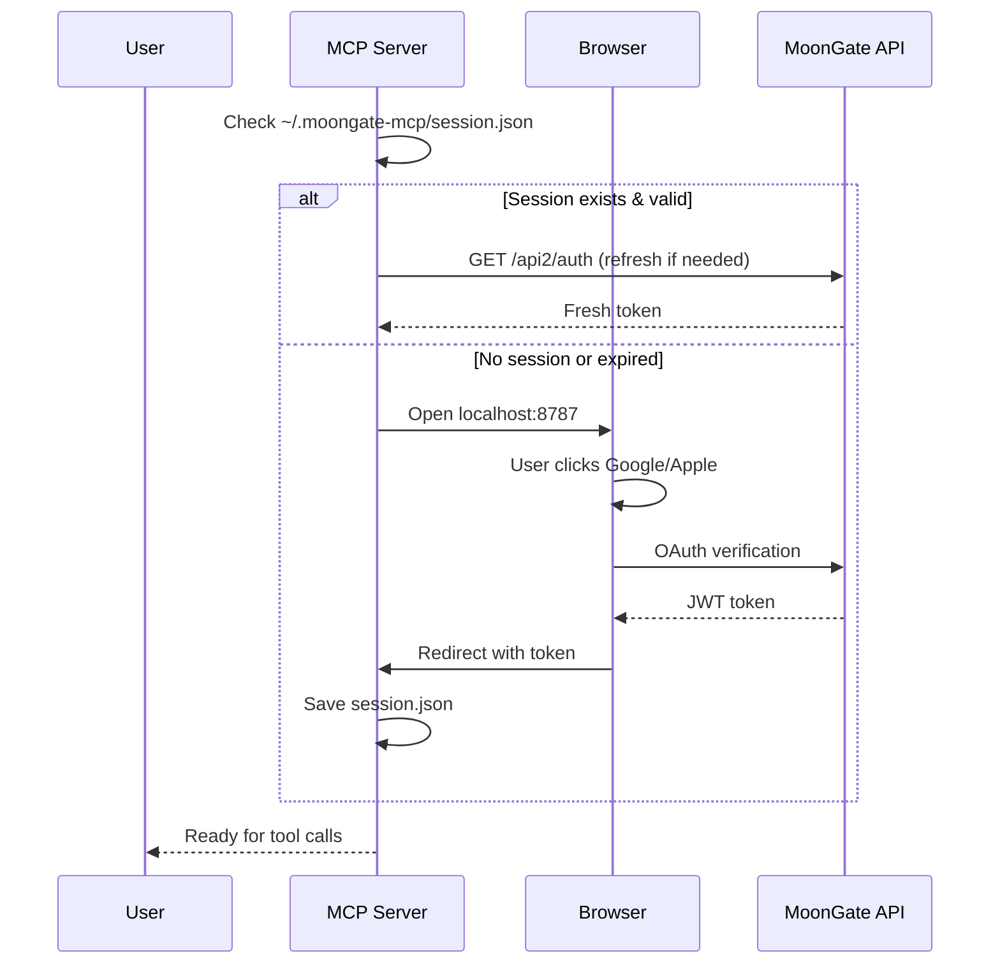

# MoonGate MCP Server

Model Context Protocol (MCP) server for [MoonGate](https://moongate.one) - the Solana wallet with zero-friction authentication.

This server enables AI assistants like Claude Desktop and Cursor to interact with your MoonGate wallet:
- 🔑 Sign transactions and messages
- 💸 Send tokens (SOL and SPL tokens)
- 📊 View portfolio and balances
- 🔄 Swap tokens
- 🔐 OAuth-based authentication (Google/Apple)

## Quick Start

### Installation

```bash
npm install -g @moongate/mcp-server
```

### Configuration

#### For Claude Desktop

Add to your `~/Library/Application Support/Claude/claude_desktop_config.json` (macOS) or `%APPDATA%\Claude\claude_desktop_config.json` (Windows):

```json
{
  "mcpServers": {
    "moongate": {
      "command": "npx",
      "args": ["-y", "@moongate/mcp-server"],
      "env": {
        "MOONGATE_API_URL": "https://wallet.moongate.one"
      }
    }
  }
}
```

#### For Cursor

Add to your Cursor MCP settings:

```json
{
  "mcpServers": {
    "moongate": {
      "command": "npx",
      "args": ["-y", "@moongate/mcp-server"]
    }
  }
}
```

### First Run

When you first use a MoonGate tool, the server will:
1. Open your browser to the MoonGate login page
2. Ask you to sign in with Google or Apple
3. Save your session locally in `~/.moongate-mcp/session.json`
4. Auto-refresh your token as needed (7-day expiry)

Sessions persist between runs - you only need to authenticate once!

## Available Tools

### `get_wallet_address`

Get your MoonGate wallet's public key (address).

```
// No parameters required
```

**Returns:**
```json
{
  "publicKey": "5xGj3..."
}
```

---

### `sign_message`

Sign a message with your wallet.

**Parameters:**
- `message` (string | number[]): The message to sign

**Returns:**
```json
{
  "signature": "4vJ5a..."
}
```

---

### `sign_transaction`

Sign a Solana transaction (optionally broadcast it).

**Parameters:**
- `serializedTransaction` (number[]): Serialized transaction bytes
- `type` (string): Transaction type - "legacy" or "versioned" (default: "versioned")
- `broadcast` (boolean): Whether to broadcast after signing (default: false)
- `includePayerSignature` (boolean): Include payer signature (default: true)

**Returns:**
```json
{
  "signatures": ["..."],
  "signedTransaction": [/* bytes */],
  "txSignature": "3nZ4..." // if broadcast=true
}
```

---

### `send_token`

Send SOL or SPL tokens to another address.

**Parameters:**
- `tokenMint` (string): Token mint address (use native SOL mint for SOL)
- `toAddress` (string): Recipient wallet address
- `amount` (number): Amount to send
- `decimals` (number): Token decimals (default: 9 for SOL)
- `userWallet` (string): Optional - sender address (auto-detected if omitted)

**Returns:**
```json
{
  "success": true,
  "signature": "2wE3..."
}
```

---

### `get_portfolio`

Get wallet portfolio (tokens, balances, NFTs).

**Parameters:**
- `walletAddress` (string): Optional - wallet to query (defaults to your wallet)

**Returns:**
```json
{
  "tokens": [...],
  "totalValue": 1234.56,
  "nfts": [...]
}
```

---

### `swap_token`

Swap tokens via MoonGate DEX integration.

**Parameters:**
- `inputMint` (string): Input token mint address
- `outputMint` (string): Output token mint address
- `amount` (number): Amount of input token to swap
- `slippage` (number): Slippage tolerance in bps (default: 100 = 1%)

**Returns:**
```json
{
  "signature": "4xK2...",
  "outputAmount": 123.45
}
```

## Environment Variables

| Variable | Description | Default |
|----------|-------------|---------|
| `MOONGATE_API_URL` | MoonGate API base URL | `https://wallet.moongate.one` |
| `MOONGATE_CALLBACK_PORT` | OAuth callback port | `8787` |
| `MOONGATE_MCP_DEBUG` | Enable debug logging | `false` |
| `MOONGATE_TOKEN` | Manual token (for testing) | - |

## Development

### Local Setup

```bash
git clone https://github.com/invictusdhahri/moongate-mcp-server.git
cd moongate-mcp-server
npm install
npm run build
```

### Testing

For quick testing without OAuth flow, set a manual token:

```bash
export MOONGATE_TOKEN="your-jwt-token"
npm run dev
```

### Building

```bash
npm run build
```

The built files will be in `dist/`.

## Authentication Flow



## Security

- **Session Storage**: Tokens stored in `~/.moongate-mcp/session.json` with `0o600` permissions (user read/write only)
- **Auto-Refresh**: Tokens automatically refresh when within 1 hour of expiry
- **Password-less Signing**: All signing operations use empty password per MoonGate OAuth design
- **Local OAuth**: Authentication happens via localhost callback, not exposing credentials

## Roadmap

- [x] Phase 1: Core tools (get address, sign message/tx)
- [x] Phase 2: OAuth browser flow, send tokens
- [x] Phase 3: Portfolio & swap tools
- [ ] Phase 4: npm publish as `@moongate/mcp-server`
- [ ] Phase 5: Apple Sign-In support (currently Google only)
- [ ] Phase 6: NFT-specific operations
- [ ] Phase 7: DeFi integrations (stake, lend, etc.)

## Troubleshooting

### "Not authenticated" error

Your session may have expired. Delete `~/.moongate-mcp/session.json` and restart:

```bash
rm ~/.moongate-mcp/session.json
```

### OAuth callback times out

Make sure port 8787 is available (or set `MOONGATE_CALLBACK_PORT` to another port).

### Debug logging

Enable verbose logging:

```bash
export MOONGATE_MCP_DEBUG=true
```

## Contributing

Contributions welcome! Please open an issue or PR.

## License

MIT

## Links

- [MoonGate Website](https://moongate.one)
- [MoonGate Docs](https://docs.moongate.one)
- [Model Context Protocol](https://modelcontextprotocol.io)
- [GitHub Repository](https://github.com/invictusdhahri/moongate-mcp-server)

---

**Built with ❤️ for the Solana ecosystem**
